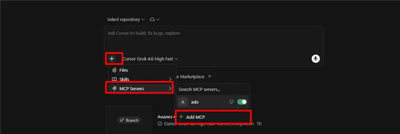

# Облачный агент Cursor в Teams

Настройка **для сотрудника**. Репозиторий публичный — приглашение в GitHub не нужно. У каждого свои учётка Cursor и PAT Azure DevOps.

[Cursor_Integration](https://github.com/shilov2704-sketch/Cursor_Integration) — только конфигурация агента. **Токен ADO в репозитории не хранится.** MCP работает с PAT, который вы сами указали в Cursor.

---

## Как это устроено

```text
@Cursor создай баг   или   @Cursor сделай анализ
        ↓
Ваш Cloud Agent (ваша учётка Cursor)
        ↓
Читает конфигурацию из Cursor_Integration
        ↓
Ваш секрет AZURE_DEVOPS_PAT + ваш MCP Azure DevOps
        ↓
Баг или анализ в HubEx от вашего имени
```

---

## Шаг 1. Репозиторий конфигурации

Репозиторий публичный: [shilov2704-sketch/Cursor_Integration](https://github.com/shilov2704-sketch/Cursor_Integration). Клонировать его не нужно.

---

## Шаг 2. Cursor: GitHub и Cloud Agents

Войдите в **свою** учётку на [cursor.com](https://cursor.com).

1. [Integrations](https://cursor.com/dashboard/integrations) — подключите **GitHub**.
2. [Cloud Agents](https://cursor.com/dashboard/cloud-agents) — включите Cloud Agents (нужен usage-based pricing).
3. **Default repository:** `shilov2704-sketch/Cursor_Integration`  
   Тогда в Teams достаточно писать `@Cursor создай баг`, без имени репозитория.

---

## Шаг 3. Свой PAT в Azure DevOps

Токен должен быть **ваш**, организация **melston**.

1. [Create PAT](https://dev.azure.com/melston/_usersSettings/tokens).
2. **New Token:**
   - Name: например `Cursor Cloud Agent`
   - Organization: `melston`
   - Scopes:
     - **Work Items** → Read & write
     - **Code** → Read
3. Скопируйте токен сразу. В git и в чат его не класть.

Баги создаются от имени владельца PAT. Assign агент оставляет пустым.

---

## Шаг 4. Секрет PAT в вашем Cursor

1. [Cloud Agents → Secrets](https://cursor.com/dashboard/cloud-agents).
2. Добавьте секрет:
   - **Name:** `AZURE_DEVOPS_PAT` (точно так)
   - **Value:** ваш PAT из шага 3
3. Сохраните.

---

## Шаг 5. MCP Azure DevOps

MCP задаётся **у вас в Cursor**, не берётся из репозитория.

В чате Cursor:

1. Нажмите **+** слева внизу поля ввода.
2. **MCP Servers**.
3. **+ Add MCP**.



В форме заполните поля (JSON вставлять нельзя):

| Поле | Что ввести |
|---|---|
| Name | `ado` |
| Type / транспорт | Command / stdio (не HTTP) |
| Command | `npx` |
| Args | `-y` `@azure-devops/mcp` `melston` `--authentication` `pat` |
| Env — имя | `PERSONAL_ACCESS_TOKEN` |
| Env — значение | `${env:AZURE_DEVOPS_PAT}` |

Не выбирайте HTTP и не указывайте `mcp.dev.azure.com`.

`${env:AZURE_DEVOPS_PAT}` подставляет секрет из шага 4. Сохраните. Для Teams нужен **новый** запуск агента.

Если MCP нет, `@Cursor создай баг` всё ещё может сработать по секрету PAT. Для `@Cursor сделай анализ` MCP обязателен.

---

## Шаг 6. Cursor в Microsoft Teams

Под **своей** учёткой Cursor.

1. [Integrations](https://cursor.com/dashboard/integrations) → **Microsoft Teams** → **Connect**.  
   Или [приложение в Marketplace](https://marketplace.microsoft.com/en-us/product/WA200010720).
2. Установите или откройте Cursor в Teams.
3. Подтвердите связку аккаунта.
4. Напишите `@Cursor help`. Если просит войти — ваша учётка Cursor.

---

## Шаг 7. Как пользоваться

Только **тред канала** (не личка и не групповой чат).

В треде уже есть суть бага. Ответом:

```text
@Cursor создай баг
```

```text
@Cursor сделай анализ
```

| Команда | Что делает |
|---|---|
| `создай баг` | Заводит Bug в HubEx по треду и присылает ссылку |
| `сделай анализ` | Смотрит код HubEx через ваш MCP. Баг не создаёт |

Обе фразы в одном сообщении: сначала анализ, потом баг.

В баге: шаблон WEB / Backend / МП, теги `DEV` + клиент + `Create Cursor agent`, Assign пустой, фактический и ожидаемый результат.

---

## Если что-то не так

| Что видите | Что сделать |
|---|---|
| Агент не тот репозиторий | Шаг 2: Default repository = `Cursor_Integration` |
| Нет карточки / не стартует | Шаги 2 и 6: Cloud Agents, Teams Connect |
| Просит открыть Web или Desktop | Писать в **треде канала** |
| «AZURE_DEVOPS_PAT is missing» | Шаги 3–4: свой PAT, имя секрета точно `AZURE_DEVOPS_PAT` |
| MCP не логинится / 401 | Шаг 5: свой токен через `${env:AZURE_DEVOPS_PAT}` |
| Баг 403 | Права на HubEx, scope Work Items Read & write |
| Анализ без кода | Шаг 5 + у PAT scope **Code Read** |
| Баг от чужого имени | В Secrets чужой PAT — замените на свой |
